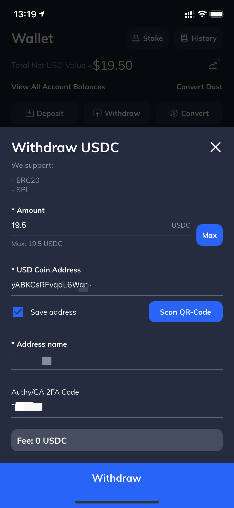

# MEDIA 代币 IDO 指南

Author：Touko

本指南不构成投资建议，*No Financial Advise* 

License: AGPLv3

## 项目简介

### SOL (Solana)

Solana 是一条专注于安全和高速交易的公链，目前正在发展阶段。和 ETH / BSC 类似，SOL 链使用代币 SOL 作为其转账的 Gas fee。其价格便宜且交易处理速度快。主要由 FTX 支持。

参考资料

https://solana.com/

部分 Solana 链上项目 - https://www.8btc.com/article/6627646

为DEX交易而生，Raydium结合订单簿打通流动性 - https://zhuanlan.zhihu.com/p/357646529

### Rayduim (RAY)

RAY 是一个建立在 SOL 链上的 AMM （自动做市商）平台。

参考资料

官网 - https://raydium.io/

介绍，The Raydium Protocol - https://raydium.medium.com/the-raydium-protocol-9809464e0105

### Media Network (MEDIA)

Media Network is a privacy-first and community-governed CDN. 

Media Network 是一个优先考虑隐私的、社区自治的 CDN。目前他们正在平台 RAY 筹备 IDO。

## Media 公募相关

本次 IDO 的详细介绍可以查看链接

https://raydium.medium.com/media-network-launching-on-acceleraytor-66b3453d4e56

### **AcceleRaytor** 

本次 IDO 的对象是 Media Network 的代币 MEDIA，共 100, 000 代币会在本次售出（总发行量的1%），每枚代币 10u。官网分为两个池子，一个池子是 RAY 质押池，要求用户于发售前七天将 20 RAY 存在 RAY Staking 池中（目前已经来不及了）。另一个池子是社区池，没有参与门槛。

RAY 池中，用户投入数量是 50 - 600 USDC，而社区池的投入数量是 50 - 450 USDC，两个池子的公募份额各 50%（各 50, 000 枚）。如果发生超募，则按比例投入，剩余金额退还至用户。代币不锁仓，于发售十二小时后（LP IDO 开启时）发放给用户，剩余的 USDC （如果有）也会返还。

### **LP IDO**

代币发售后 12 小时，LP IDO 将会开启，用户可以存入 MEDIA-USDC LP 挖矿，挖矿奖励为 MEDIA。挖矿地址为 https://raydium.io/fusion/ 。LP IDO 可以挖出 50, 000 枚代币（供应量的 0.5%）

## 如何参与

参与此次 IDO 需要准备 SOL 钱包，和 ETH / BSC / HECO 相同。Chrome 浏览器可用的钱包有 Sollet （插件钱包，https://chrome.google.com/webstore/detail/sollet/fhmfendgdocmcbmfikdcogofphimnkno），手机可用 Math Wallet（https://mathwallet.org/en-us/）。导入助记词或者生成新钱包来参与交易。

转账需要 SOL 代币作为 Gas Fee，SOL 代币可以在 Binance 购买并转出，转出时选择 SOL 链。

USD 可以通过 FTX 交易所中转。FTX 交易所支持 BEP2 链转账 BUSD，然后转成 USDC 到自己的 SOL 钱包。跨链费用大约 0.5 USD。

如果没注册过 FTX 交易所，可以走我的推荐链接 https://ftx.com/#a=15853406 注册。

以下是转账的详细步骤

FTX 交易所选择 Deposit USD - BUSD

Binance 提现，通过 BEP2 链转账至 FTX，一定要写好所有信息，特别是 Memo。

FTX 交易所到账后，转出为 USDC，地址填写 SOL（SPL）钱包地址。

