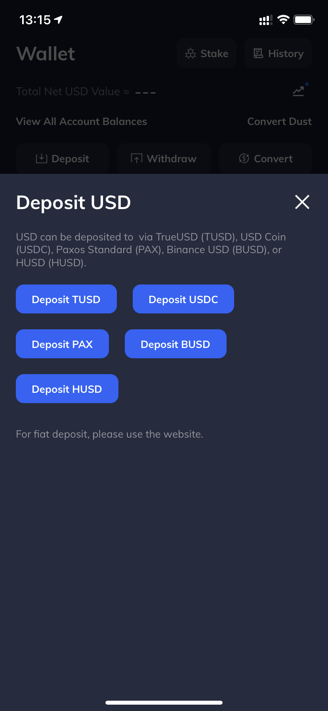
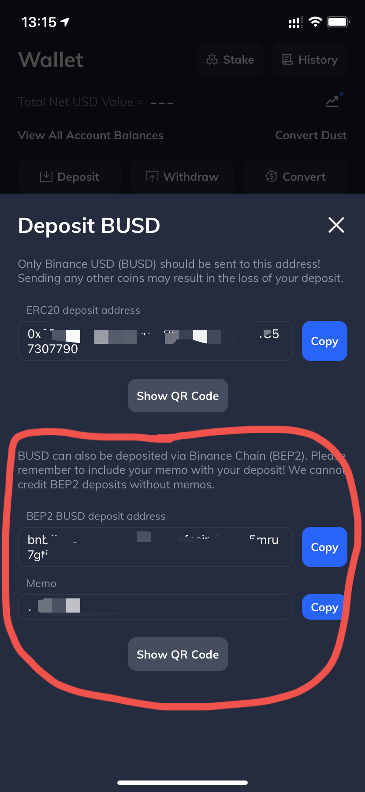
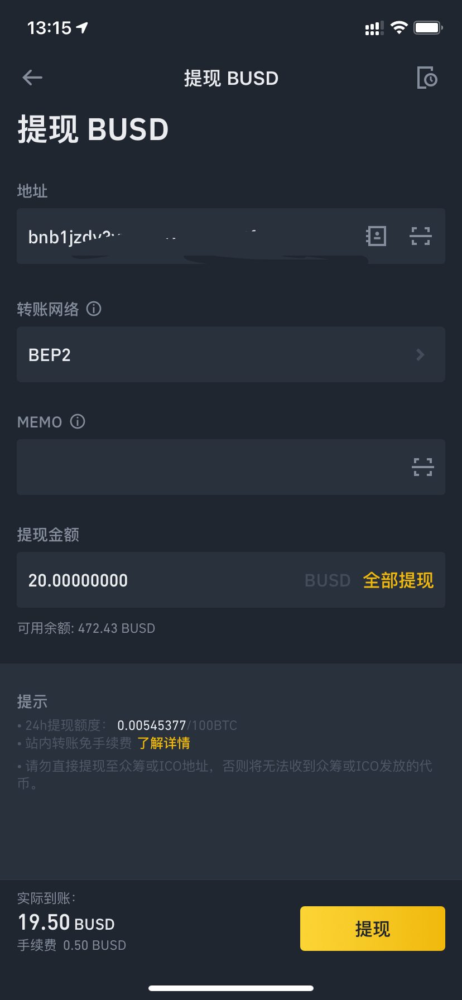

# Mercurial Finance (MER) 代币 IDO 指南

Author：Touko

发布于 http://github.com/HoshinoTouko/CryptoDocs

本指南不构成投资建议，*No Financial Advise* 

License: AGPLv3

## 项目简介

### SOL (Solana)

Solana 是一条专注于安全和高速交易的公链，目前正在发展阶段。和 ETH / BSC 类似，SOL 链使用代币 SOL 作为其转账的 Gas fee。其价格便宜且交易处理速度快。主要由 FTX 支持。

参考资料

https://solana.com/

部分 Solana 链上项目 - https://www.8btc.com/article/6627646

为DEX交易而生，Raydium结合订单簿打通流动性 - https://zhuanlan.zhihu.com/p/357646529

### Rayduim (RAY)

RAY 是一个建立在 SOL 链上的 AMM （自动做市商）平台。

参考资料

官网 - https://raydium.io/

介绍，The Raydium Protocol - https://raydium.medium.com/the-raydium-protocol-9809464e0105

### Mercurial Finance (MER)

Mercurial is building dynamic market making vaults, providing low slippage swaps for stables, while also improving liquidity pool profits with dynamic fees and flexible capital allocation.

## Mercurial Finance 公募相关

本次 IDO 的详细介绍可以查看链接

https://raydium.medium.com/mercurial-finance-launching-on-acceleraytor-9e7ac60a21df

### **AcceleRaytor** 

本次 IDO 的对象是 MER，共 2, 000, 000 代币会在本次售出（总发行量的0.2%），每枚代币 0.125u。官网分为两个池子，分别是 50RAY 池和 500RAY 池（本次没有公开池）。其中 50RAY 池子允许投入最大 200USDC，500RAY 池允许投入最大 600USDC。对应数量的 RAY 需要在 May 12, 12:00 UTC（也就是2021.5.12 晚 20：00 UTC+8，Shanghai Time）投入 Ray Single Staking 池 https://raydium.io/staking/ 。

## Tips

### 本次 IDO 的预计收益

本次的 IDO 代币同时在 Ray 和 FTX 上线。FTX 往期 IEO 收益可以看 https://ftx.com/ieos 。Ray 的 IDO 收益大约是 12 倍投入资金（即单账户投入 450u，分到 5u，能收到 60u 以上的收益）。

### 如何防止 IDO 结束后 RAY 暴跌

FTX 交易所有 RAY-PERP 永续合约，如果担心 IDO 结束，RAY 暴跌，可以开**和持仓同等数量的 RAY 永续合约空单**对冲风险。

谨记，根据自己的风险承受能力评估是否参与。

**这只是一个指南文档，No Financial Advise**

## 如何参与

参与此次 IDO 需要准备 SOL 钱包，和 ETH / BSC / HECO 相同。Chrome 浏览器可用的钱包有 Sollet （插件钱包，https://chrome.google.com/webstore/detail/sollet/fhmfendgdocmcbmfikdcogofphimnkno），手机可用 Math Wallet（https://mathwallet.org/en-us/）。导入助记词或者生成新钱包来参与交易。

转账需要 SOL 代币作为 Gas Fee，SOL 代币可以在 Binance 购买并转出，转出时选择 SOL 链。

USD 可以通过 FTX 交易所中转。FTX 交易所支持 BEP2 链转账 BUSD，然后转成 USDC 到自己的 SOL 钱包。跨链费用大约 0.5 USD。

如果没注册过 FTX 交易所，可以走我的推荐链接 https://ftx.com/#a=15853406 注册。

## 从 Binance 转 USD 到 SOL 链

FTX 交易所选择 Deposit USD - BUSD

Binance 提现，通过 **BEP2 链**转账至 FTX，一定要写好所有信息，**特别是 Memo**。

FTX 交易所到账后，转出为 USDC，地址填写 SOL（SPL）钱包地址。

